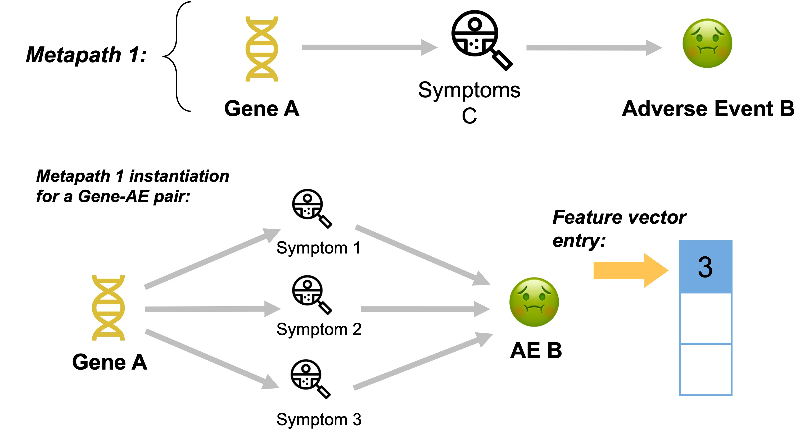
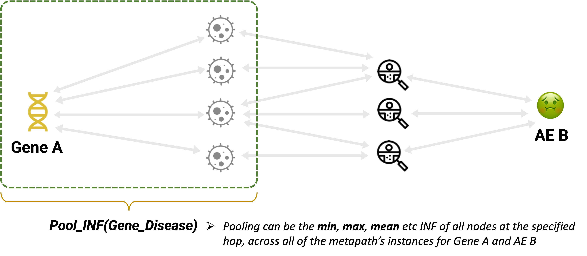
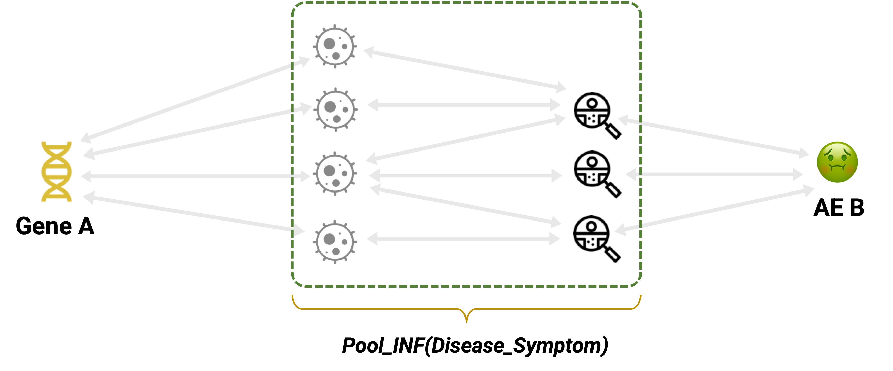
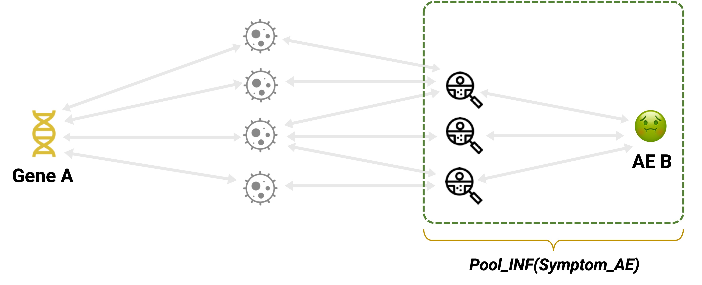
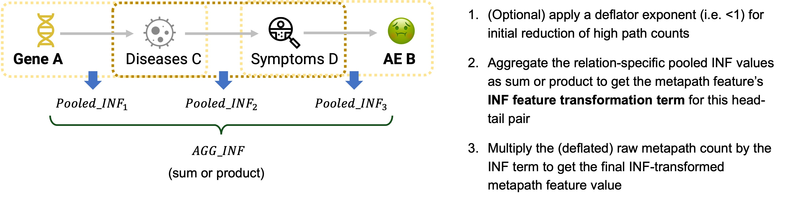

# Summary

`metapaths` is a Python package for extracting and transforming path-based features for use in knowledge graph (KG) completion. It implements a novel feature transformation procedure developed by the author to mitigate the common KG problem of topological bias, improving KG completion accuracy on low-degree nodes. This feature transformation approach achieves this by translating the information retrieval concept of Inverse Document Frequency to the graph context, as "Inverse Node Frequency" (INF).

See the Theory section further below for an introduction to path-based knowledge graph completion and for further details on the INF approach for bias correction implemented by `metapaths`.

# Installation

`pip install metapaths`

# Description

## The `metapaths.inf` module

The centrepiece of `metapaths` is the `INFToolbox` class contained in this module. `INFToolbox` requires the KG to be held in a Neo4j graph database, which it accesses via a `py2neo.Graph` object. The class method `run_pipeline` extracts INF-transformed metapath features for specified head-tail pairs, using the specified INF transformation parameter combinations.

The extracted features are returned as values in a dictionary whose keys are the indices of the parameter combinations. 

`INFToolbox` provides the pre-processing method `get_reltype_counts` for extracting the number of instances of each relation type in the Neo4j graph. This information is a key component of the novel bias-mitigating procedure applied in the pipeline. `get_reltype_counts` is left outside `run_pipeline` to allow the user to provide their own instance counts if desiring to only consider a subset of relation types. 

Another noteworthy method of `INFToolbox` is `add_param_combos` which extends the list of INF transformation parameter combinations stored in the `INFToolbox.param_combos` attribute.

Selected steps from `run_pipeline` are also available as class methods. One example is `get_inf_dict_save` which extracts the pooled INF data at each relation of a metapath feature's instances for a head-tail pair (see Theory section). Another example is `get_nodes_freq_dict` which extracts the relation-specific degrees of all nodes in the graph. The outputs of these methods can thus support EDA workflows on the KG.

## The `metapaths.starterpack` module

This supporting module enables exhaustive metapath Cypher pattern generation from a list of Cypher KG triple patterns e.g. `["(:Film)-[:Released_in]->(:Year)", "(:Film)-[:Features]->(:Song)" ...]` and for formatting these patterns for consumption by `INFToolbox.run_pipeline` and other methods.

See `metapaths_reqs.txt` for the list of package dependencies.

# Theory

## The problem of topological imbalance in knowledge graphs

Knowledge graphs (KGs) are a natural representation for interconnected data with rich semantics. Network science has also shown that information contained in the graph can be exploited towards inferring new edges. In the KG context, this inference task is known as knowledge graph completion (KGC).

A common feature of networks and their graph representations, including KGs, is topological imbalance. The essence of this phenomenon is the existence of high-degree "hub" nodes, which correspondingly appear in large portions of the graph's edges. For example, in a biomedical KG, a few therapeutic targets might be involved in thousands of associations with adverse drug reactions.

The presence of hub nodes can reflect the real-world network structure e.g. a subset of therapeutic targets may be functionally important in many biological processes whose disruption (e.g. by drugging one of these targets) is likely to provoke adverse events. However, topological imbalance can also indicate human bias independent of the actual network structure. For example, excessive research attention directed at a given entity (e.g. a lucrative therapeutic target) can result in comparatively greater accumulation of knowledge about it, which is then reflected as a hub profile for that entity's node in the KG.

Any KGC method that naively relies on the graph topology "as-is" will come to associate high-degree nodes with the KG relation(s) of interest. At inference time such KGC approaches will assign new edges to high-degree nodes irrespective (Bonner et al 2022) of the actual knowledge contained in the KG. Conversely, this means poor inference for low-degree nodes. This presents a major problem in scientific contexts, as low node degree often indicates a less-studied entity where a good prediction is most critical.

## Metapath-based KG completion

The `metapaths` package implements feature extraction for classical metapath-based KGC (e.g. Sun et al 2011; Fu et al 2016; Himmelstein et al 2017). Metapath-based KGC frames the inference problem as a classification task where each head-relation-tail KG triple's features, in their raw form, are counts of distinct path types ("metapaths") that occur between the head and tail (see illustration below).

Metapath count features therefore retain a direct reference to domain semantics, and the contribution of distinct semantic portions of the KG to model performance can be readily assessed by feature importance procedures. This makes metapath-based KGC conceptually attractive in domains where "legibility" of the route from data to prediction is crucial, such as the life sciences. Metapath-based KGC therefore stands in contrast with KG "embedding" methods, the most popular form of KGC, which operate on latent-space representations of the KG and are therefore inherently opaque, "black box" strategies.

However, metapath-based KGC that relies solely on raw path counts will inevitably learn the same topological imbalances that plague all KGC approaches that naively exploit the KG structure. The core functionality of `metapaths` is the implementation of a novel procedure (author's work; currently in preparation for academic publication) to correct topological imbalances in the raw path counts. 

## Translating a classic Information Retrieval idea to tackle the problem of KG topological imbalance

### From IDF to INF

Inverse Document Frequency or IDF (Spärck Jones 1972) is a well-known information retrieval concept. It uses the rarity of a term (i.e. a word) across a document corpus as a signal of its specificity. In retrieval, documents where highly specific terms occur frequently will therefore prioritised. In text classification, IDF can likewise be used to categorise documents based on the most specific terms that occur frequently in each category.

IDF can be translated to the KG context to quantify the rarity of a node in a given relation type. Following the classic IDF construction, a node's INF in a given relation is computed as:

$INF_n^R = \log(\frac{N^R}{d_n^R})$

where $N^R$ is the number of instances of relation type $R$ and $d_n^R$ is the degree of node $n$ in $R$. Hub nodes that dominate a relation type will have lower INF values in that relation type, and vice versa for nodes that rarely appear in that relation type.

### From INF to transformed metapath counts

As outlined above, in their raw form metapath features are the counts of each metapath (of the set being considered) for the given node pair. Each metapath count thus represents a set of metapath "instances" i.e. actual paths in the KG, with each instance traversing a sequence of nodes that conform to that metapath.

Moreover, each node in the path is part of one KG triple (if the node is the head or tail entity at the start or end of the path) or two KG triples. Given the set of a metapath's instances between a head-tail pair, the INF values of all nodes at a given metapath "step" or "hop" can be pooled (e.g. averaged) to represent the overall specificity of the paths at that hop (see illustrations).

Having computed the pooled INF values, these can then be aggregated as a sum or product to arrive at an INF term for the set of all instances of the metapath for the given head-tail pair (see illustration).

As discussed previously, low degree can mean specificity as well as human bias. Because it is the result of INF pooling within each metapath hop and then aggregating across the hops, a high INF term will represent consistent node "rarity" across multiple relation types. Such consistency can support our confidence that the resulting rare paths signal robust, genuine specificity rather than a chance sequence of under-studied, low-degree nodes.

The INF term is multiplied by the metapath's raw count for the head-tail pair to produce the INF feature value transformation. Greater overall path rarity (represented by a greater INF term) will therefore provide a greater feature value boost.

During testing of the INF transformation procedure it was also found that applying a "deflator exponent" i.e. `0 >= exp < 1` before applying the INF term achieves better KGC performance than the INF term alone. This is intuitive, as extremely high metapath counts (as generated by very high-degree nodes) may need to be meaningfully dampened to strengthen the relative INF boost to the lower metapath counts (as generated by lower-degree nodes).

The transformed feature values are then ready for use in training and inference with any tabular data ML classifier design.

### References

1. Spärck Jones, K. (1972). A statistical interpretation of term specificity and its application in retrieval. Journal of documentation, 28(1), 11-21.
2. Lao, N., Mitchell, T., & Cohen, W. (2011, July). Random walk inference and learning in a large scale knowledge base. In Proceedings of the 2011 conference on empirical methods in natural language processing (pp. 529-539).
3. Sun, Y., Barber, R., Gupta, M., Aggarwal, C. C., & Han, J. (2011, July). Co-author relationship prediction in heterogeneous bibliographic networks. In 2011 International Conference on Advances in Social Networks Analysis and Mining (pp. 121-128). IEEE.
4. Fu, G., Ding, Y., Seal, A., Chen, B., Sun, Y., & Bolton, E. (2016). Predicting drug target interactions using meta-path-based semantic network analysis. BMC bioinformatics, 17(1), 1-10.
5. Himmelstein, D. S., Lizee, A., Hessler, C., Brueggeman, L., Chen, S. L., Hadley, D., ... & Baranzini, S. E. (2017). Systematic integration of biomedical knowledge prioritizes drugs for repurposing. Elife, 6, e26726.
6. Bonner, S., Kirik, U., Engkvist, O., Tang, J., & Barrett, I. P. (2022). Implications of topological imbalance for representation learning on biomedical knowledge graphs. Briefings in bioinformatics, 23(5), bbac279.
